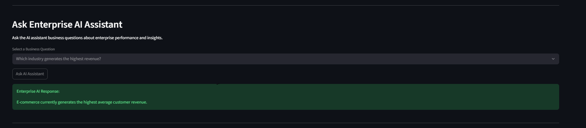
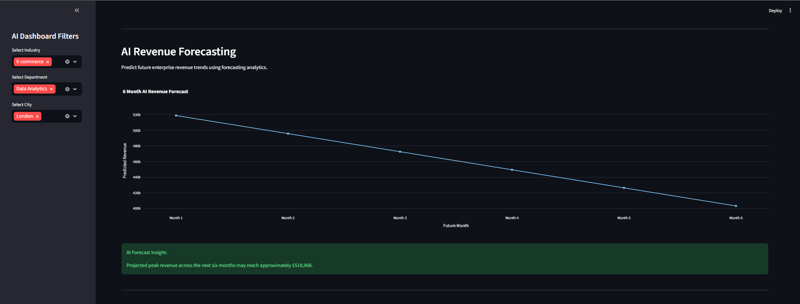
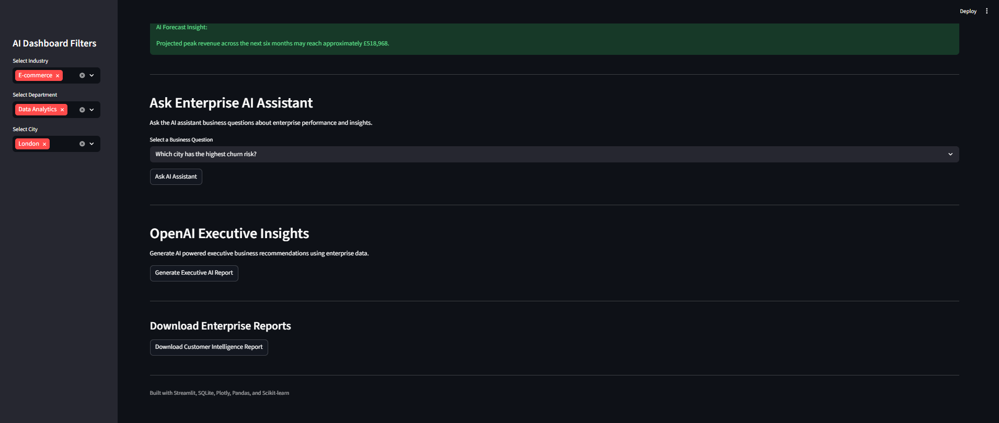

# Enterprise AI Insights Assistant

An AI powered enterprise intelligence platform designed for UK businesses to generate predictive analytics, executive insights, forecasting intelligence, and operational recommendations through machine learning and interactive business analytics.

This project combines enterprise business intelligence, predictive AI systems, forecasting analytics, OpenAI powered executive intelligence, and simulated enterprise assistant capabilities into a modern AI driven analytics platform.

---

# Live Demo

Streamlit App:  
https://saint-matthew-enterprise-ai-insights-assistant-app-jhzt8s.streamlit.app/

---

# Dashboard Preview

## Executive AI Dashboard

Interactive enterprise intelligence dashboard with AI powered KPI monitoring, customer analytics, operational insights, and predictive business intelligence.



---

## Enterprise Analytics

Advanced enterprise analytics visualizations including customer segmentation, sales conversion analysis, operational efficiency metrics, and employee productivity insights.



---

## OpenAI Executive Insights

Integrated OpenAI powered executive reporting system capable of generating strategic business recommendations, executive summaries, growth opportunities, and enterprise risk analysis.



---

# Project Overview

Enterprise organizations generate large amounts of operational, customer, sales, and financial data daily. Extracting actionable intelligence from this data is essential for strategic business decision making.

This project simulates a real world enterprise AI analytics system capable of:

- Analyzing enterprise business performance
- Predicting customer revenue
- Forecasting future revenue trends
- Identifying operational risks
- Generating AI business recommendations
- Simulating enterprise AI assistant interactions
- Producing executive insights using OpenAI integration

The platform was designed around UK enterprise business operations and intelligent analytics workflows.

---

# Core Features

## Executive AI Dashboard
- Enterprise KPI monitoring
- Revenue intelligence
- Productivity analysis
- Churn risk tracking
- Customer analytics
- Executive business summaries

## AI Business Recommendations
Automatically generated enterprise insights including:
- Revenue opportunities
- Churn risk alerts
- Productivity analysis
- Operational improvement suggestions

## Predictive Analytics Engine
Machine learning powered prediction system for:
- Customer revenue prediction
- Business forecasting
- Enterprise performance analysis

## AI Revenue Forecasting
- 6 month revenue forecasting
- Trend prediction
- Growth analytics
- Forecast visualization

## Enterprise AI Assistant
Interactive AI assistant capable of answering:
- Revenue intelligence questions
- Churn risk analysis
- Productivity insights
- Business performance queries

## OpenAI Executive Insights
OpenAI powered executive reporting system that generates:
- Business summaries
- Strategic recommendations
- Operational insights
- Risk analysis
- Growth opportunities

## Interactive Business Intelligence
- Dynamic filtering
- Interactive visualizations
- Enterprise analytics dashboards
- Downloadable reports

---

# System Architecture and Project Layers

The project is structured using separated concerns to improve scalability, maintainability, modularity, and enterprise level software organization.

---

## Frontend Layer

Responsible for dashboard rendering, visualization, user interaction, and enterprise reporting interfaces.

### Technologies
- Streamlit
- Plotly

### Responsibilities
- Interactive enterprise dashboards
- KPI visualization
- Executive reporting interfaces
- Business analytics rendering
- Dynamic filters and controls
- User focused analytics experience

### Frontend Components

```text
streamlit_app.py
```

---

## Backend Layer

Responsible for business logic, enterprise workflows, data handling, and operational processing.

### Technologies
- Python
- Pandas
- NumPy
- SQLite

### Responsibilities
- Enterprise data preprocessing
- Workflow orchestration
- Revenue analytics computation
- Operational business logic
- Database interaction
- Data transformation pipelines

### Backend Components

```text
main.py
database.py
generate_dataset.py
```

---

## Machine Learning Layer

Responsible for predictive analytics, forecasting systems, and intelligent enterprise modeling.

### Technologies
- Scikit-learn
- Linear Regression

### Capabilities
- Revenue prediction
- Forecasting intelligence
- Predictive business analytics
- Churn risk prediction
- Trend analysis
- Enterprise performance modeling

### ML Techniques
- Linear Regression
- Label Encoding
- Train/Test Split Validation
- R² Accuracy Evaluation

---

## OpenAI Intelligence Layer

Responsible for AI generated executive intelligence and strategic reporting systems.

### Technologies
- OpenAI API
- Python Dotenv

### Capabilities
- Executive summary generation
- Strategic business recommendations
- Operational intelligence reporting
- Enterprise risk analysis
- Growth opportunity analysis

### Security

The OpenAI integration is optional and requires a local `.env` configuration file.

---

## Data Layer

Responsible for enterprise dataset management and structured business records.

### Enterprise Datasets
- Customer intelligence
- Revenue analytics
- Employee productivity
- Operational metrics
- Sales performance

### Dataset Structure

```text
datasets/
├── customers.csv
├── employees.csv
├── operations.csv
├── revenue.csv
└── sales.csv
```

---

## Infrastructure and Deployment Layer

Responsible for deployment workflows, hosting, repository management, and cloud accessibility.

### Technologies
- Git
- GitHub
- Streamlit Cloud
- Docker

### Responsibilities
- Cloud deployment
- Version control management
- Repository workflows
- Public application hosting
- Deployment scalability
- Containerization support

---

# Tech Stack

- Python
- Streamlit
- SQLite
- Pandas
- Plotly
- NumPy
- Scikit-learn
- OpenAI API
- Python Dotenv
- Git
- GitHub
- Streamlit Cloud
- Docker

---

# Project Structure

```text
enterprise-ai-insights-assistant/
│
├── datasets/
│   ├── customers.csv
│   ├── employees.csv
│   ├── operations.csv
│   ├── revenue.csv
│   └── sales.csv
│
├── screenshots/
│   ├── assistant.png
│   ├── forecasting.png
│   └── openai.png
│
├── ai_enterprise.db
├── streamlit_app.py
├── database.py
├── generate_dataset.py
├── main.py
├── requirements.txt
├── Dockerfile
├── README.md
├── .gitignore
└── .env
```

---

# Run Project Locally

## 1. Install Dependencies

```bash
pip install -r requirements.txt
```

## 2. Generate Datasets

```bash
python generate_dataset.py
```

## 3. Create Database

```bash
python database.py
```

## 4. Start Dashboard

```bash
streamlit run streamlit_app.py
```

---

# OpenAI Integration

The project supports optional OpenAI powered executive insights generation for strategic business recommendations and enterprise analytics.

Create a local `.env` file:

```text
OPENAI_API_KEY=your_api_key_here
```

Important:
- Never upload `.env` files publicly
- Never expose API keys inside repositories

---

# Enterprise Modules

## Customer Intelligence
- Customer segmentation
- Revenue analysis
- Churn monitoring
- Industry analytics

## Sales Intelligence
- Sales conversion analytics
- Deal analysis
- Revenue performance tracking

## Operations Intelligence
- Operational efficiency monitoring
- Department performance analysis
- Enterprise productivity analytics

## Employee Insights
- Productivity tracking
- Sales performance analysis
- Team intelligence dashboards

---

# AI Capabilities

The platform demonstrates:
- Enterprise AI systems
- Predictive machine learning
- Business forecasting
- AI generated recommendations
- OpenAI API integration
- Executive intelligence systems
- Intelligent business analytics

---

# Future Improvements

Planned future upgrades include:
- Real time enterprise APIs
- Authentication systems
- Multi user support
- NLP powered conversational AI
- Advanced forecasting models
- AI anomaly detection
- PostgreSQL integration
- Role based dashboards
- Cloud scalability optimization

---

# Project Goal

The objective of this project is to demonstrate:
- Applied artificial intelligence
- Enterprise machine learning systems
- Business intelligence engineering
- Predictive analytics
- Executive AI systems
- Data visualization
- Intelligent enterprise automation

---

# Author

Matthew Obayemi

Computer Science Student  
University of the People

---

# License

This project demonstrates the application of enterprise artificial intelligence, predictive analytics, machine learning, and intelligent business intelligence systems for modern enterprise decision support.

